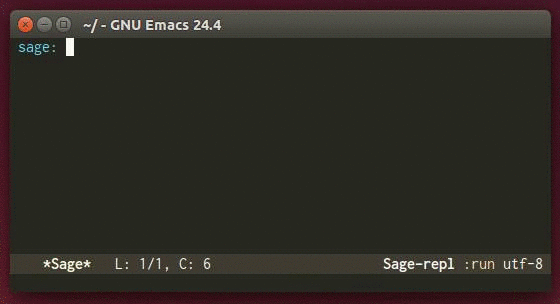

# Overview

`auto-complete-sage` provides an [auto-complete](https://github.com/auto-complete/auto-complete)
 source for [sage-shell-mode](https://github.com/stakemori/sage-shell-mode).



# Installation
You can install `auto-complete-sage` from
[MELPA](https://github.com/milkypostman/melpa.git) by package.el
(`M-x package-install auto-complete-sage`).

For the setting of [auto-complete](https://github.com/auto-complete/auto-complete),
see the [manual](http://cx4a.org/software/auto-complete/manual.html)
of `auto-complete-mode`.

`auto-complete-sage` provides specific sources for `sage-shell-mode`.
To add these sources to `ac-sources`, put the following lines to `"~/.emacs.d/init.el"`:
```lisp
(eval-after-load "auto-complete"
  '(setq ac-modes (append '(sage-shell-mode sage-shell:sage-mode) ac-modes)))
(add-hook 'sage-shell:sage-mode-hook 'ac-sage-setup)
(add-hook 'sage-shell-mode-hook 'ac-sage-setup)
```

# Tab Completion
`auto-complete-sage` replaces the default completion function of
`sage-shell-mode` (`completion-at-point`) by `auto-complete`.
If you want to use `completion-at-point` for the Tab completion,
put the following line to `"~/.emacs.d/init.el"`:

```
(setq sage-shell:completion-function 'completion-at-point)
```


# Tips
To complete global Sage objects in a buffer whose major mode is
`sage-shell:sage-shell-mode`,
run the Sage process and set the process buffer by
`M-x sage-shell:set-process-buffer` in the `sage-shell:sage-shell-mode`
 buffer.
